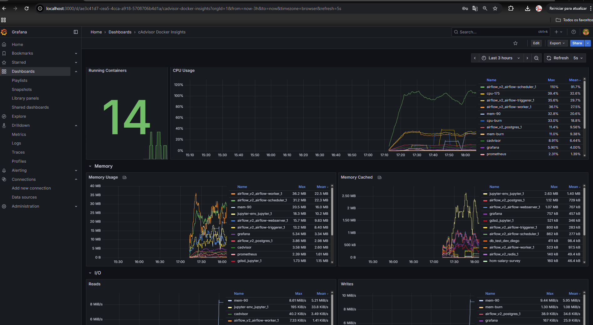
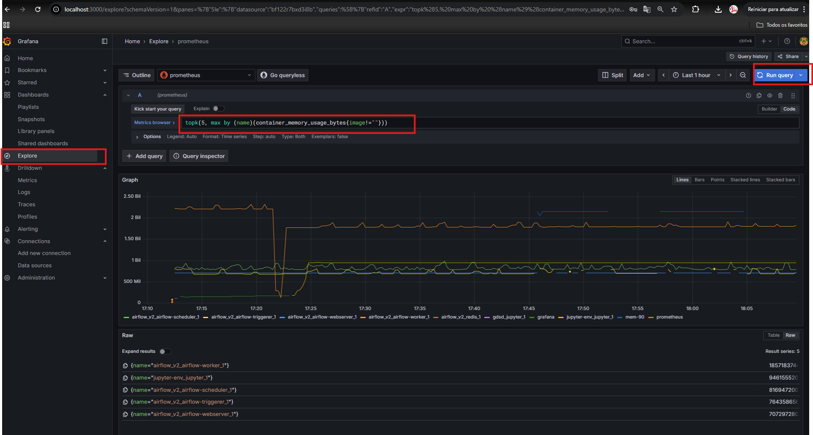

# Grafana + Prometheus + cAdvisor (monitorando containers Docker)
**Autor:** Diego Silva  

Projeto acadêmico para **definir uma ferramenta de métrica, implementar um exemplo e analisar resultados** usando:
- **Prometheus** (coleta/armazenamento de métricas)
- **cAdvisor** (exporta métricas de containers Docker para o Prometheus)
- **Grafana** (visualização e análise)

> Objetivo: tratar **cada container** como uma “instância” e analisar **CPU, memória, disco e rede** com testes de carga controlados.

---

## Sumário
- [Arquitetura](#arquitetura)
- [Estrutura do repositório](#estrutura-do-repositório)
- [Requisitos](#requisitos)
- [Subir o ambiente](#subir-o-ambiente)
- [Acessar o Grafana e configurar Prometheus](#acessar-o-grafana-e-configurar-prometheus)
- [Importar o dashboard pronto (ID 19908)](#importar-o-dashboard-pronto-id-19908)
- [Explorar métricas e criar painéis (PromQL)](#explorar-métricas-e-criar-painéis-promql)
- [Testes de estresse (CPU, memória, disco e rede)](#testes-de-estresse-cpu-memória-disco-e-rede)
- [Consultas PromQL usadas](#consultas-promql-usadas)
- [Boas práticas e dicas](#boas-práticas-e-dicas)
- [Referências](#referências)

---

## Arquitetura
```
Docker containers
        │
     cAdvisor  ─────────┐
        │               │
        └── /metrics → Prometheus ← (raspagem/scrape)
                                │
                                └── Grafana (dashboards, PromQL, alertas)
```

- **cAdvisor** expõe métricas por container (CPU, memória, I/O, rede).
- **Prometheus** coleta via scrape (`/metrics`) e armazena séries temporais.
- **Grafana** lê do Prometheus e cria **dashboards**/gráficos/alertas.

---

## Estrutura do repositório
```
.
├─ docker-compose.yml   # Orquestra Prometheus, Grafana e cAdvisor
└─ prometheus.yml       # Configuração do Prometheus (scrape de cAdvisor e do próprio Prometheus)
```

### `docker-compose.yml` (o que é / para que serve)
- **prometheus**: serviço Prometheus, exposto em `9090`.
- **grafana**: serviço Grafana (UI web), exposto em `3000` (admin/admin por padrão, altere em produção).
- **cadvisor**: exporta métricas dos containers; é raspado pelo Prometheus.

### `prometheus.yml` (o que é / para que serve)
- Define o `scrape_interval` (ex.: `15s`).
- Declara **targets**: `prometheus:9090` (auto-métricas) e `cadvisor:8080` (métricas dos containers).

---

## Requisitos
- Docker e Docker Compose instalados.
- Porta **3000** livre (Grafana) e **9090** livre (Prometheus).
- Usuário com permissão para montar volumes Docker (cAdvisor geralmente precisa montar `/var/lib/docker`, etc., quando usado fora do compose oficial — nosso compose já cuida disso).

---

## Subir o ambiente
```bash
docker compose up -d
```
- **Grafana**: http://localhost:3000  (usuário: `admin`, senha: `admin` – altere depois)
- **Prometheus**: http://localhost:9090

Para parar:
```bash
docker compose down
```

---

## Acessar o Grafana e configurar Prometheus
1. Abra **http://localhost:3000** e faça login.
2. Vá em **Connections → Data sources → Add data source → Prometheus**.
3. Em **URL**, se o Grafana está no mesmo compose, use: `http://prometheus:9090`.
4. **Save & Test** para validar.

---

## Importar o dashboard pronto (ID 19908)
1. **Dashboards → New → Import**.
2. Em **Import via grafana.com**, cole **`19908`** e clique **Load**.
3. Selecione o **data source Prometheus**.
4. **Import**.



> Dica: ajuste o **Time range** para *Last 30m* e **Refresh** de 5–10s.

---

## Explorar métricas e criar painéis (PromQL)

### Onde colar as queries (Explore)
- Menu esquerdo **Explore** → selecione **Prometheus**.
- No editor, troque **Builder → Code** e **cole a PromQL**. Clique **Run query**.

### Criar painéis (no dashboard)
- Abra um dashboard → **Add panel** → **Data source: Prometheus** → **Code**.
- Cole a query, ajuste **Legend** para `{{name}}` (nome do container) e **Unit**:
  - CPU: *Cores* (ou Percent com eixo até 200).
  - Memória: *Bytes*.
  - Disco/Rede: *Bytes/sec*.

### Sobre PromQL (por que tem esse nome e como ler)
- **PromQL** é a *Prometheus Query Language* (linguagem de consulta do Prometheus).
- **`rate(…[20s])`**: taxa/segundo calculada numa janela (ex.: 20s) sobre um **contador cumulativo**.
- **`sum by (name)(…)`**: agrega por rótulo `name` (nome do container no cAdvisor).
- **`topk(5, …)`**: pega o **Top 5** valores mais altos da expressão.
- Métricas cAdvisor (exemplos):
  - **`container_cpu_usage_seconds_total`**: tempo de CPU acumulado (segundos) por container → usamos `rate` para virar “cores”.
  - **`container_memory_usage_bytes`**: bytes de memória em uso.
  - **`container_fs_*`**: I/O de disco por container.
  - **`container_network_*`**: bytes/packets de rede RX/TX por container.

> Usamos janela **curta (20–30s)** para **enxergar picos**; dashboards prontos costumam usar 5m (suavizam demais).

---

## Testes de estresse (CPU, memória, disco e rede)

> **Execute um por vez.** Todos saem limpos com `--rm`.  
> Para marcar os testes no gráfico, crie **Annotations**: *Dashboard → Settings → Annotations → Add* (ex.: “CPU 175% 4min”).

### 1) CPU a 150% e 175% (estável e visível no topo)
Fixes aplicados: **pinar CPUs**, método estável e carga calibrada.

```bash
# 150% ≈ 1.5 cores por ~3-4 min
docker run --rm --name cpu-150 \
  --cpus=2 --cpuset-cpus=0,1 \
  alpine sh -c 'apk add --no-cache stress-ng >/dev/null && \
  stress-ng --cpu 2 --cpu-method matrixprod --cpu-load 75 --timeout 240s'

# 175% ≈ 1.75 cores por ~3-4 min
docker run --rm --name cpu-175 \
  --cpus=2 --cpuset-cpus=0,1 \
  alpine sh -c 'apk add --no-cache stress-ng >/dev/null && \
  stress-ng --cpu 2 --cpu-method matrixprod --cpu-load 88 --timeout 240s'
```

Se outro serviço “roubar” CPU:
- Pare containers concorrentes durante o teste **ou**
- Limite-os temporariamente: `docker update --cpus 1 <container>`

**Conferir no Explore (janela curta):**
```promql
sum by (name)(rate(container_cpu_usage_seconds_total{name=~"cpu-(150|175)"}[20s]))
```

### 2) Memória alta (próximo do limite do container)
```bash
docker run --rm --name mem-90 --memory=2g \
  alpine sh -c 'apk add --no-cache stress-ng >/dev/null && \
  stress-ng --vm 3 --vm-bytes 90% --vm-keep --timeout 180s'
```

**Painel:**
```promql
topk(5, max by (name)(container_memory_usage_bytes{image!=""}))
```

### 3) Disco forte (I/O real do host com fio)
```bash
docker run --rm --name disk-fio -v /tmp:/tmp \
  alpine sh -c 'apk add --no-cache fio >/dev/null && \
  fio --name=w --filename=/tmp/fio.test --size=10G \
      --bs=256k --rw=write --iodepth=64 --numjobs=4 \
      --ioengine=libaio --direct=1 --runtime=180 && rm -f /tmp/fio.test'
```

**Painéis:**
```promql
topk(5, sum by (name)(rate(container_fs_writes_bytes_total{image!=""}[20s])))
topk(5, sum by (name)(rate(container_fs_reads_bytes_total{image!=""}[20s])))
```

### 4) Rede forte (alto throughput e concorrência)
**Alvo (nginx):**
```bash
docker run -d --name nginx-bench -p 8088:80 nginx:alpine
```

**Carga (Linux nativo):**
```bash
docker run --rm --name net-strong --network host williamyeh/wrk \
  -t8 -c1500 -d180s http://127.0.0.1:8088/
```
> Em Docker Desktop/WSL: `http://host.docker.internal:8088/` e sem `--network host`.

**Painéis:**
```promql
topk(5, sum by (name)(rate(container_network_receive_bytes_total{image!=""}[20s])))
topk(5, sum by (name)(rate(container_network_transmit_bytes_total{image!=""}[20s])))
```

---

## Consultas PromQL usadas

### Pico “de verdade” (janela curta)
```promql
topk(5, sum by (name)(rate(container_cpu_usage_seconds_total{image!=""}[20s])))
```
- **Unit:** *Cores* (ou Percent; defina eixo até **200**).
- Evita a média longa (5m) que suaviza picos rápidos.

### CPU, Memória, Disco e Rede
```promql
# CPU (Top 5)
topk(5, sum by (name)(rate(container_cpu_usage_seconds_total{image!=""}[20s])))

# Memória (Top 5)
topk(5, max by (name)(container_memory_usage_bytes{image!=""}))


# Disco (writes / reads)
topk(5, sum by (name)(rate(container_fs_writes_bytes_total{image!=""}[20s])))
topk(5, sum by (name)(rate(container_fs_reads_bytes_total{image!=""}[20s])))

# Rede (RX / TX)
topk(5, sum by (name)(rate(container_network_receive_bytes_total{image!=""}[20s])))
topk(5, sum by (name)(rate(container_network_transmit_bytes_total{image!=""}[20s])))
```

---

## Boas práticas e dicas
- Use **Annotations** para demarcar os testes (CPU 150%, CPU 175%, Mem 90%, etc.).
- Ajuste **janela do `rate`** (20–30s durante os testes; 1–5m para visão “macro”).
- **Alerta simples**: CPU > 80% por 2m em um container crítico; configure no Grafana.
- **Extensões futuras**: adicionar `node-exporter` para métricas do host; Loki/Promtail para logs; alertas e SLIs/SLOs.

---

## Referências

- AWS — *O que é o Amazon Managed Grafana?*  
  https://docs.aws.amazon.com/pt_br/grafana/latest/userguide/what-is-Amazon-Managed-Grafana.html
- Grafana Docs — *Import dashboards*  
  https://grafana.com/docs/grafana/latest/dashboards/build-dashboards/import-dashboards/
- Prometheus Docs — *Querying basics (PromQL)*  
  https://prometheus.io/docs/prometheus/latest/querying/basics/

---


